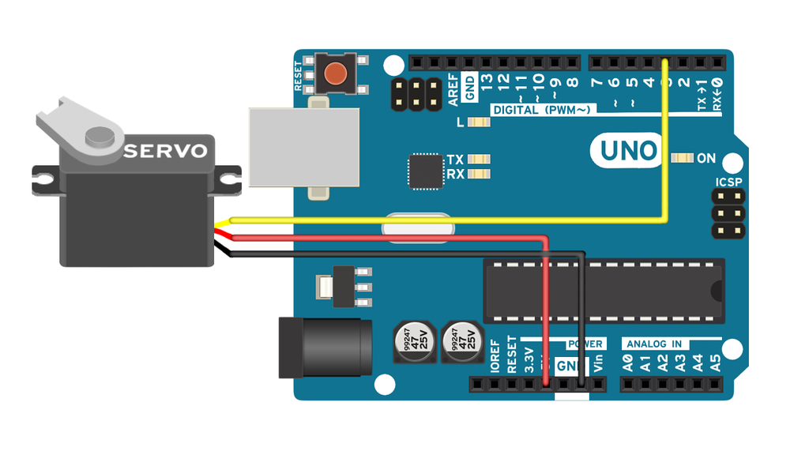

# Robot Arm Movement

## Using Arduino UNO & Servo Motor Developed with React Javascript

## Server

- Using `express` server & `johnny-five` to control the robot arm
- `johnny-five` is a library for controlling the robot arm

## Client

- Using `react` to render the UI
- `react-speech-recognition` is a library for speech recognition

### Important Notice

`NOTE: We need Arduino UNO and Arduino IDE to achieve this`
We will download [Firmata](https://github.com/firmata/arduino) and [Arduino IDE](https://www.arduino.cc/en/software) and for the Arduino to run with the `johnny-five` library, we need to deploy `firmata` to the Arduino.

1. Open `Arduino IDE`
2. Create example Sketch from Files > Examples > StandardFirmataPlus
   
3. Upload the sketch to the Arduino
   

   `for more troubleshooting instructions, please refer to` **[this](https://github.com/rwaldron/johnny-five/wiki/Getting-Started#prerequisites)**

### Arduino Setup

I used a Servo and Connected it to `pin 8` with `5V` of Power and `GND`.


### Starting the project

Make sure you did the **Important Notice**

- Server-Side

```bash
cd server
yarn
yarn start
```

- Client-Side

```bash
cd client
yarn
yarn start
```

### Walk-through

1. Open `Visual Studio Code` or any other text editor.
2. Start using two terminals (`server` & `client`)
3. Install Dependencies using `yarn` on both terminals
4. Plug up your Arduino you should receive a message saying

```py
 #Timestamp#    #Status#           #Port#
1660235534040   Available   /dev/tty.usbserial-110
1660235534043   Connected   /dev/tty.usbserial-110
```

5. Start up the project using `yarn start` on the server terminal and `yarn start` on the client terminal
6. Open `http://localhost:3000` in the browser if didn't opened automatically
7. Test server connection by opening `http://localhost:4000/` in the browser and receive `I am alive` response
8. You're good to go!


## Troubleshooting

If you have a problem with node/npm/yarn, try to identify the problem and fix it.

Common Problems:

- Versioning Problems, keep everything up to date, download the latest version of [Node.js LTS](https://nodejs.org) and [Yarn](https://yarnpkg.com)
- What is `yarn`? yarn is a package manager for the JavaScript programming language. It is a tool for managing dependencies. to Download `yarn` run `npm i -g yarn` and you're good to go.
- Arduino Problems? Which problem? did you upload the Firmata sketch to the Arduino? If you did, try to upload the sketch again. If you still have problems, try to reset the Arduino. Press and hold the button for maybe 11 seconds or so. if the problem persist check the ports and make sure you have the correct Arduino connected. and to the same port as identified or for MacBook/Linux Users in the terminal, run `ls /dev/tty.*` to see which port is connected. for Windows Users, run `devmgmt.msc` and select `Serial Ports` to see which port is connected. Try to remove the port from `johnny-five Board` and then try to reconnect. Make sure to connect USB2.0 with a USB2.0 Serial.
- Everything is working except the Servo is not moving! What is wrong? check the `Servo` pin number in the `johnny-five Servo` and make sure it is correct.

### Just4you (peekok)
